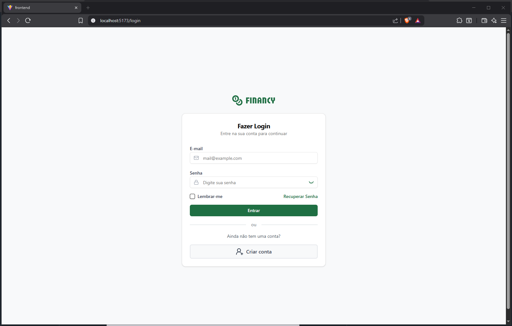
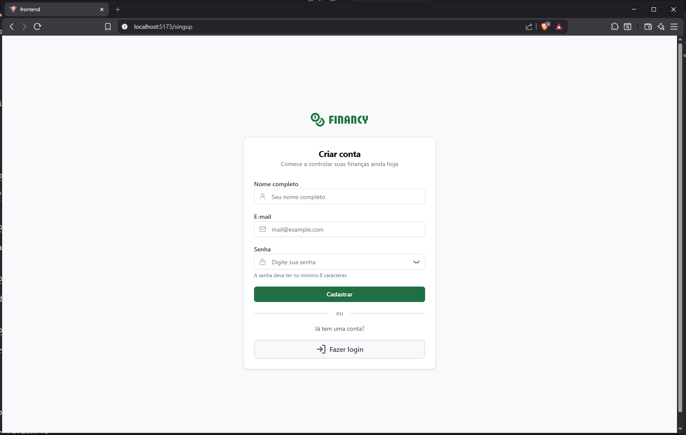
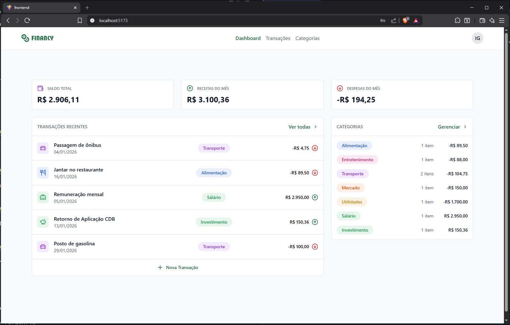
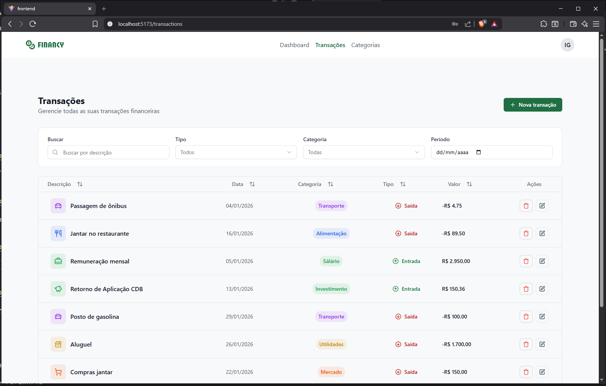
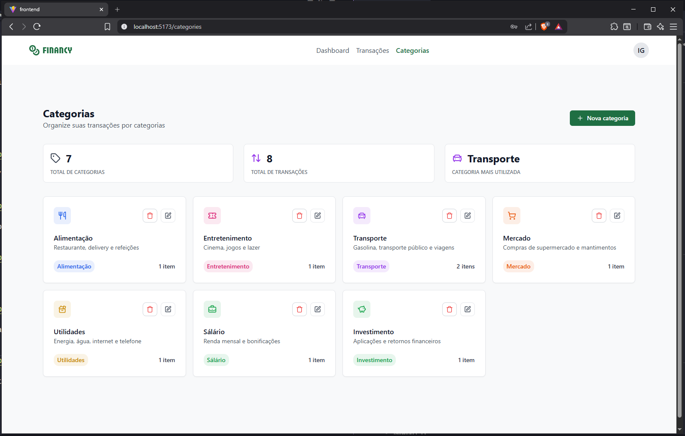
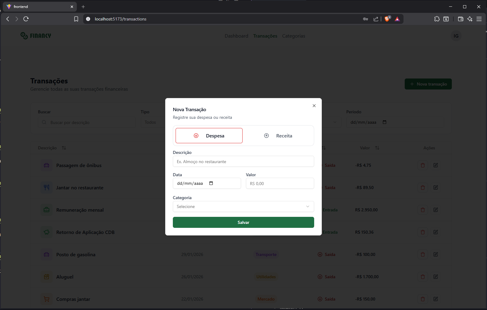
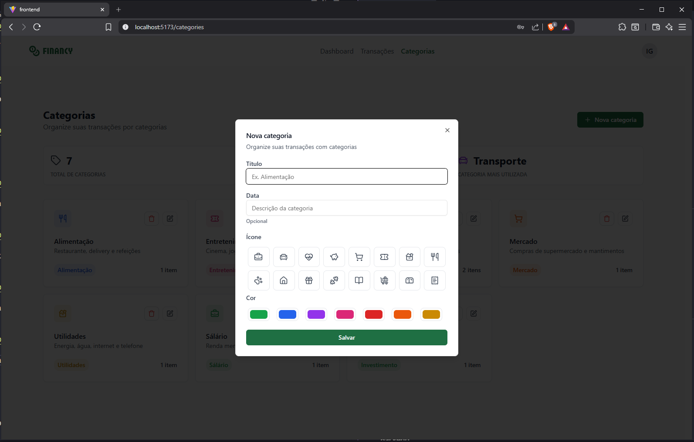
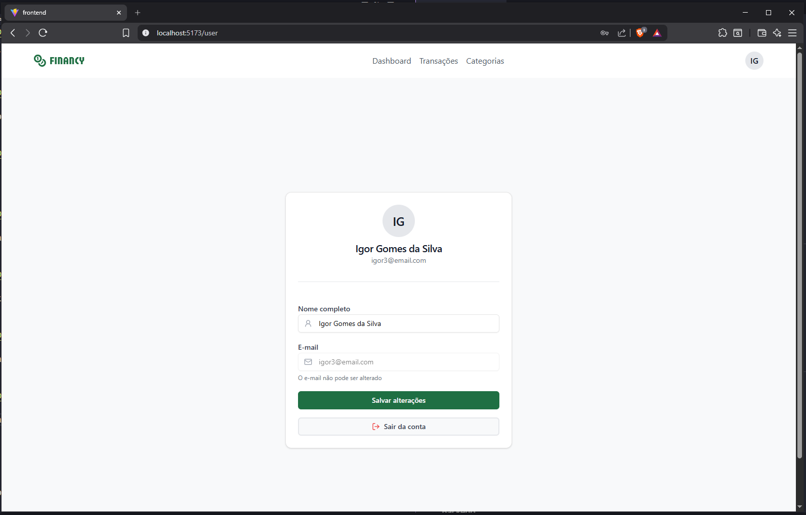

# 💵 Financy - Sistema de Gerenciamento Financeiro


O **Financy** é uma aplicação FullStack de gestão financeira pessoal desenvolvida como projeto de avaliação final para a Pós Tech Developer da [Faculdade de Tecnologia da Rocketseat](https://www.rocketseat.com.br/faculdade).

O projeto aplica conceitos avançados de arquitetura de software, com foco especial na implementação de uma API **GraphQL** robusta e uma interface reativa e performática.


## 🚀 Sobre o Projeto

A aplicação foi concebida para oferecer uma experiência fluida no controle de ativos e passivos. O diferencial técnico reside na integração entre o **Apollo Server** (Node.js) e o **Apollo Client** (React), permitindo consultas granulares e uma gestão de estado eficiente no front-end.

**Principais Diferenciais:**
 - **Arquitetura Monorepo:** Organização clara entre camadas de front-end e back-end.
 - **Tipagem Estrita:** Uso de TypeScript em todo o ecossistema para garantir segurança em tempo de compilação.
 - **UX/UI Moderna:** Interface construída com Radix UI (via Shadcn) e estilização utilitária com Tailwind CSS.

## 📸 Preview do Projeto
Abaixo estão algumas capturas de tela do Financy em funcionamento:

<table width="100%">
  <tr>
    <td align="center" width="50%">
      
      <em>Tela de acesso ao Financy</em>
    </td>
    <td align="center" width="50%">
      
      <em>Tela de cadastro de usuário</em>
    </td>
  </tr>
  <tr>
    <td align="center" width="50%">
      
      <em>Página de dashboard</em>
    </td>
    <td align="center" width="50%">
      
      <em>Página para listagem de transações</em>
    </td>
  </tr>
  <tr>
    <td align="center" width="50%">
      
      <em>Página para listagem de categorias</em>
    </td>
    <td align="center" width="50%">
      
      <em>Modal para cadastro de novas transações</em>
    </td>
  </tr>
  <tr>
    <td align="center" width="50%">
      
      <em>Modal para cadastro de novas categorias</em>
    </td>
    <td align="center" width="50%">
      
      <em>Tela de dados do usuário</em>
    </td>
  </tr>
</table>


## ✨ Funcionalidades
 - **Autenticação e Autorização:** Fluxo completo de criação de conta e login seguro.
 - **Gestão de Categorias:** Personalização total com ícones e cores dinâmicas.
 - **Fluxo de Caixa:** Lançamento de entradas e saídas vinculado a categorias.
 - **Filtros Avançados:** Busca e filtragem de transações por período ou tipo.
 - **Dashboard Estatístico:** Visualização em tempo real de saldos, totais de entrada e saída.
 - **Persistência Relacional:** Exclusão em cascata (ao remover uma categoria, as transações vinculadas são tratadas automaticamente).


## 🛠️ Tecnologias Utilizadas
### Frontend
 - **Core:** React com TypeScript.
 - **Estado Global:** Zustand (Gerenciamento leve e performático).
 - **Comunicação API:** Apollo Client (Integração direta com GraphQL).
 - **UI Components:** Shadcn/UI & Tailwind CSS.
 - **Ícones:** Lucide-react.

### Backend
 - **Runtime:** Node.js com Express.
 - **API:** GraphQL via Apollo Server.
 - **ORM:** Prisma (Type-safe queries).
 - **Database:** SQLite (Agilidade no desenvolvimento e avaliação).


## 🖥️ Configuração e Instalação
### Pré-requisitos
 - Node.js (v22.18 ou superior)
 - Gerenciador de pacotes npm

### Etapas de configuração:

#### 1. Clonagem do Repositório:
```bash
git clone https://github.com/Igor2502/Financy.git
cd financy
```

---

#### 2. Backend
 - 2.1 Navegue até o diretório ``backend``:
```bash
cd backend
```

 - 2.2 Instale as dependências:
```bash
npm install
```

 - 2.3 Crie um arquivo ``.env`` com as variáveis de ambiente necessárias (exemplo disponível em ``.env.example``).
 ```bash
cp .env.example .env
 ```

 - 2.4 Execute as migrations para atualizar a estrutura do banco de dados:
```bash
npx prisma generate
```

 - 2.5 Inicie o servidor:
```bash
npm run dev
```

 - 2.6 Caso tudo tenha dado certo você terá recebido o seguinte retorno:
```bash

> backend@1.0.0 dev
> tsx watch src/index.ts

Servidor executando na porta: 4000
```

---

#### 3. Frontend
 - 3.1 Navegue até o diretório ``frontend``:
```bash
cd frontend
```

 - 3.2 Instale as dependências:
```bash
npm install
```

 - 3.3 Crie um arquivo ``.env`` com as variáveis de ambiente necessárias (exemplo disponível em ``.env.example``).
 ```bash
cp .env.example .env
 ```

 - 3.4 Inicie a aplicação:
```bash
npm run dev
```

 - 3.5 Caso tudo tenha dado certo você terá recebido o seguinte retorno:
```bash

  VITE v7.3.0  ready in 625 ms

  ➜  Local:   http://localhost:5173/
  ➜  Network: use --host to expose
  ➜  press h + enter to show help
```

## 👨‍🎨 Créditos de Design

O design desta aplicação foi baseado no protótipo disponibilizado no [Figma](https://www.figma.com/pt-br/comunidade/file/1580994817007013257/financy) pela equipe técnica da [Rocketseat](https://www.rocketseat.com.br). Todos os direitos de design pertencem aos respectivos autores e à instituição responsável pelo desafio.

Agradeço aos instrutores pela excelente base visual que permitiu o foco total na implementação lógica e integração de dados.💜


## 🤝 Contribuição

Contribuições são bem-vindas! Sinta-se à vontade para abrir issues ou pull requests com melhorias, correções ou novas funcionalidades.


## 📄 Licença
Este projeto está licenciado sob a [MIT License](./LICENSE).


## 👨‍💻 Autor
Desenvolvido por [Igor Gomes da Silva](https://www.linkedin.com/in/igor-gomes-da-silva/). Este projeto é o resultado de uma jornada intensa de aprendizado na Pós-graduação da [FTR](https://www.rocketseat.com.br/faculdade). 🚀

<br>

---
> "Tudo que temos que decidir é o que fazer com o tempo que nos é dado."
> — Gandalf, o Cinzento 🧙🏻‍♂️
---